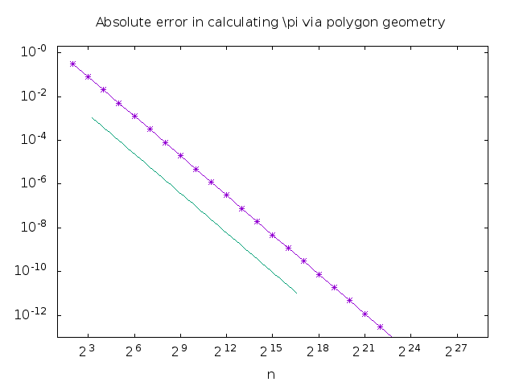

#fin1
 
The previous algorithum suffered precision loss due to the subtaction in the numerator. As n gets larger, the sine squared term approaches zero (or at least it should in theory). This tendency causes the numerator to approach 1 - (1 - something small). However, as n gets larger, the something small is lost to the machine error around one. The numerator, however, approaches a very small number, so the machine error around one becomes very prononced because the machine error around zero is much smaller than the error around one.
